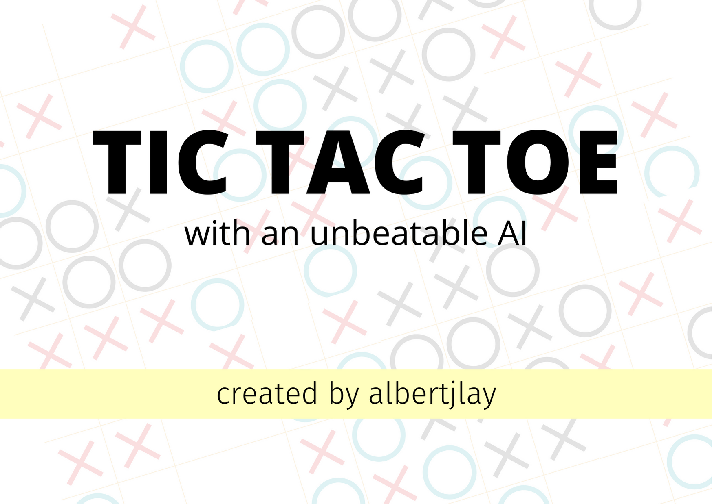
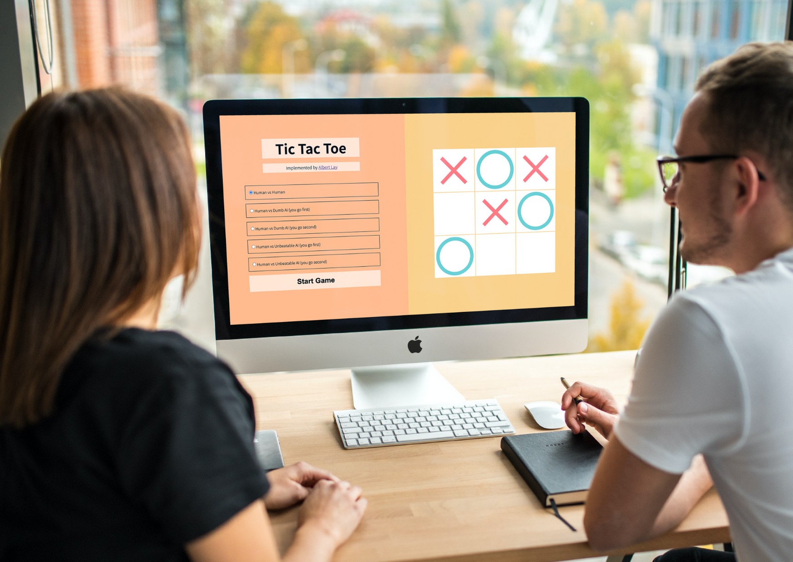
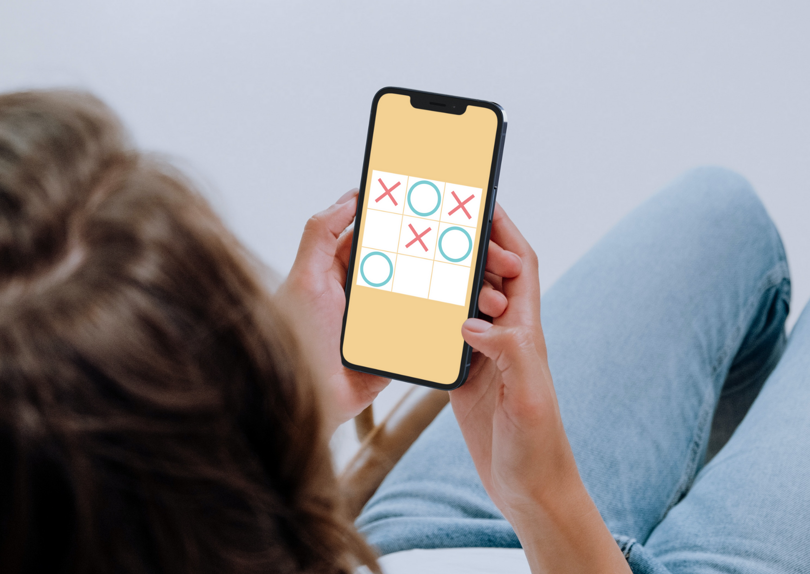
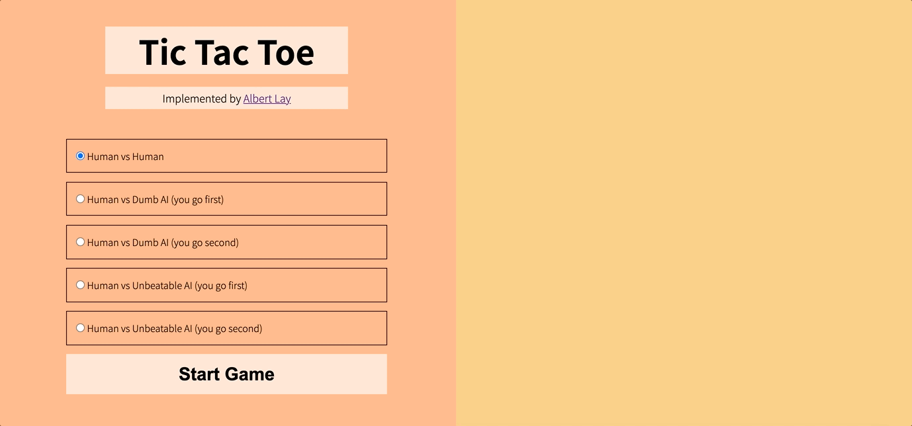
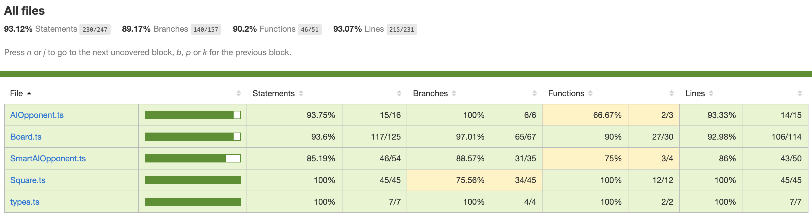

# [Tic Tac Toe](https://albertjlay.github.io/tic-tac-toe/)



- [Tic Tac Toe](#tic-tac-toe)
  - [:rocket: Overview](#rocket-overview)
    - [Play anywhere](#play-anywhere)
    - [Mix it up with three modes](#mix-it-up-with-three-modes)
  - [:man_technologist: My process](#man_technologist-my-process)
    - [:hammer_and_pick: Tools](#hammer_and_pick-tools)
    - [Languages](#languages)
    - [Tools](#tools)
  - [:books: What I learned](#books-what-i-learned)
    - [Object-oriented design is da bomb](#object-oriented-design-is-da-bomb)
    - [TypeScript + Sass = :two_hearts:](#typescript--sass--two_hearts)
    - [Best practices are the best for a reason](#best-practices-are-the-best-for-a-reason)
  - [:unicorn: Helpful resources](#unicorn-helpful-resources)
  - [:handshake: Acknowledgments](#handshake-acknowledgments)

## :rocket: Overview

### Play anywhere

|                                  Desktop                                   |                                     Mobile                                     |
| :------------------------------------------------------------------------: | :----------------------------------------------------------------------------: |
|  |  |

A responsive design that lets you play anywhere.

### Mix it up with three modes



Players can choose between three modes:

- Two players brawl it out
- Player faces off against a dumb AI which moves randomly
- Player faces off against an AI that moves based on [an algorithm proven to be unbeatable](https://en.wikipedia.org/wiki/Tic-tac-toe). It draws in the worst case, but never loses.

## :man_technologist: My process

### :hammer_and_pick: Tools

### Languages

 

### Tools

  

## :books: What I learned

### Object-oriented design is da bomb

When I was learning the principles of OOP in JavaScript, I was frankly a bit skeptical. I got the rationale behind grouping similar methods and variables together, but I didn't quite get what everyone was raving about.

That totally changed as I was doing this project. I first decided to utilize OOP to have experience in applying them and try to get a head start in one of my upcoming courses in OOP. However, as my code started to scale, I started to realize its strengths, mainly: Separation of concerns and inheritance. The former I've experienced when using modules, but the latter really impressed me, even though I barely got a taste of it.

There are still _much_ more principles I haven't even touched in OOP, but doing this project made me giddy thinking about studying them in the future.

### TypeScript + Sass = :two_hearts:

Having coded almost exclusively in C in the first quarter of the year, transitioning to JavaScript was frustrating. Although its dynamic typing grants a lot of freedom, it also introduces _so many_ errors. Moreover, JavaScript also has some quirks that caused me many headaches. TypeScript fixed all this...and then some. I particularly love being able to define type aliases, type-check "this", and make actual private class fields.

Moreover, I also used Sass more extensively in this project. I've already started using it in my [personal website](https://www.albertjlay.com/), but it was added last minute. However, I used Sass from the get-go in this project and I truly enjoyed using it. Mixins, in particular, are great. However, this project isn't too style-intensive, so I feel I haven'texperienced Sass' true powers, but I'm 100% using it in my next project.

```scss
@mixin square-background($iconURL) {
  background-image: url($iconURL);
  background-size: cover;
  background-repeat: no-repeat;
}
```

### Best practices are the best for a reason



Throughout my first-year courses, it's been drilled to me how crucial documentation and testing are. However, until a couple of weeks ago, I had thought these principles don't carry over to front-end web development. In retrospect, I think part of the reason why I thought this was is that these two things are sidelined or completely absent from most introductory JavaScript courses.

I finally brought back these two in this project, and I realized I shouldn't have left them at all. This is because I found that having automated tests enabled me to catch bugs early and having function documentation always ready on hover increased my productivity.

Furthermore, I was only able to confirm that my AI was truly unbeatable due to a testing function that I designed. It simulates randomized player moves against the AI and tests whether the AI ever loses in any of these trials. After setting the function to run 1 million times (AI goes first half the time), I was pretty sure that my AI was unbeatable.

```js
const testSmartAI = function (AIPlayerID: PlayerID, numberOfTrials: Number) {
  const randomizedMoves: SquareID[] = [0, 1, 2, 3, 4, 5, 6, 7, 8];
  for (let i = 0; i < numberOfTrials; i += 1) {
    shuffle(randomizedMoves);
    const testBoard = new Board();
    const smartAI = new SmartAIOpponent(AIPlayerID, testBoard);
    const playerID = AIPlayerID === PlayerID.playerX ? PlayerID.playerO : PlayerID.playerX;

    for (let j = 0; j < randomizedMoves.length; j += 1) {
      const randomizedFreeSquares = randomizedMoves.filter((move) =>
        testBoard.freeSquares.includes(move)
      );

      if (testBoard.isGameOver) {
        break;
      }
      // since AI will already move in its instatiation even if it moves first
      testBoard.playerMove(randomizedFreeSquares[0], playerID);

      if (testBoard.isGameOver) {
        break;
      }
      smartAI.AIMove();
    }

    const playerMovesArray =
      AIPlayerID === PlayerID.playerX ? testBoard.oSquares : testBoard.xSquares;

    expect(testBoard.isGameOver).toBe(true);
    expect(testBoard.findWins(playerMovesArray).length).toBe(0);
  }
};
```

## :unicorn: Helpful resources

- [Unbeatable Tic Tac Toe algorithm](https://en.wikipedia.org/wiki/Tic-tac-toe)
- [How to get a value from a radio button in JS](https://www.youtube.com/watch?v=cSuEAD-Tnd4)
- [Fisher-Yates shuffle for the testing function above](https://bost.ocks.org/mike/shuffle/)

## :handshake: Acknowledgments

For this project, I completely did it with no tutorial to guide me whatsoever. I devised all the classes and how it all works together. For the implementation of the unbeatable algorithm in particular, I followed the strategy outlined in the Wikipedia above, but implemented it completely on my own.

I did get some more help here and there, mainly from online resources. Most notable ones are listed above.
